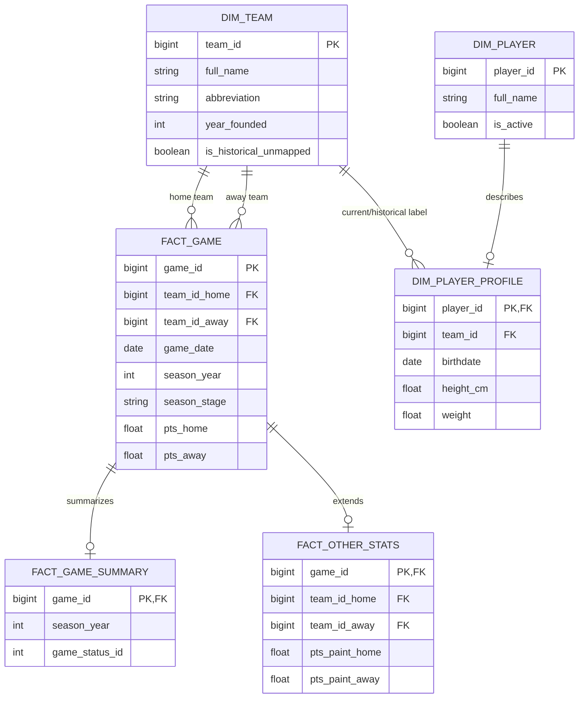

# Canonical model and ERD

I keep the source tables wide enough to preserve the published dataset, then expose analytical grain through SQL views. The physical model deliberately separates identity dimensions from game-level facts.

## Analytical bridge

`analytics.vw_team_game` turns each accepted game into exactly two records: one home-team observation and one away-team observation. Every team-season metric and Power BI question derives from that single grain. `analytics.dim_season` and `analytics.vw_bridge_team_season` provide canonical year/decade and team-season relationships without duplicating facts in Python.

For the complete column-level contract, use [`canonical_data_dictionary.md`](canonical_data_dictionary.md) and [`../contracts/schema_v1.0.0.json`](../contracts/schema_v1.0.0.json).
