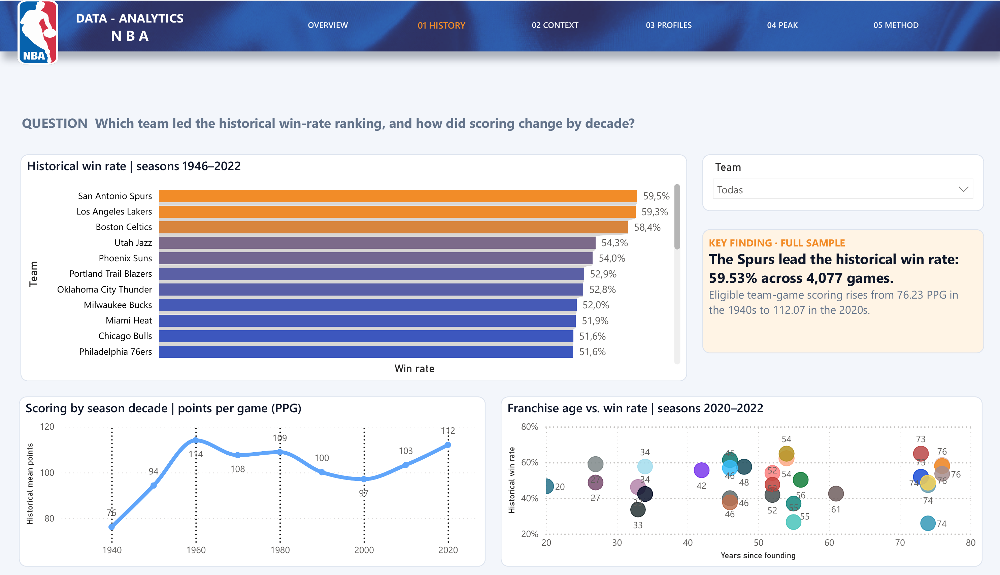
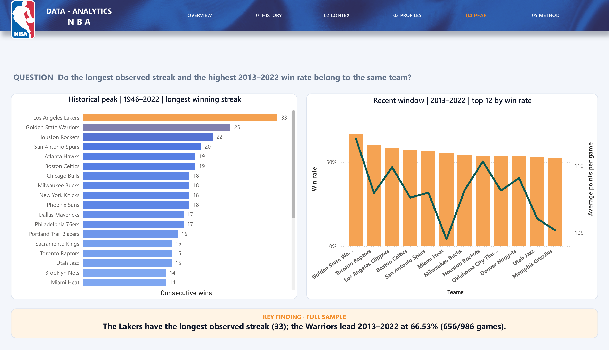

# 🏀 NBA Analytics Platform

**From raw NBA records to decisions a reviewer can check.** I built a reproducible Python → SQL Server → Power BI workflow to compare historical team performance without presenting a descriptive sample as a prediction. The English report takes you through history, home-court context, player profiles and the difference between an all-time peak and a recent-window leader.

**Start here:** [five-minute reviewer guide](DOCS/reviewer_guide.md) · [English Power BI template](CODE/Dashboard%20-%20POWERBI/NBA_Analytics_EN.pbit) · [verified result snapshot](evidence/NBA-English-2026-09-29/insight_snapshot.json). The template uses DirectQuery: the guide and code can be reviewed without an installation; opening live visuals requires your own local SQL Server load.

## The analytical result

| Question | Result in the versioned sample | What it means |
|---|---|---|
| Who leads the historical win-rate ranking? | San Antonio Spurs: **2,427 / 4,077 = 59.53%** | A sample-wide historical rate, not a forecast. |
| Does the same team lead the latest ten-season window? | Golden State Warriors: **656 / 986 = 66.53%** in seasons 2013–2022 | I use wins / games for both rankings; the leaders differ across periods. |
| What does home-court context show? | **104.69** home vs. **101.11** away points per game | These are means of eligible team-season PPG values, not a causal estimate. |
| What is the longest observed winning streak? | Los Angeles Lakers: **33** games | A historical peak in the available data. |

I changed the recent-ranking calculation from an average of team-season rates to `SUM(wins) / SUM(games_played)` so it is comparable with the historical ranking. The [snapshot](evidence/NBA-English-2026-09-29/insight_snapshot.json) records periods, denominators and other verified values.

## What I built and verified

```text
6 versioned CSVs → contract-based Python ETL → canonical CSVs + rejects + SHA-256
                 → transactional SQL Server load → 15 analytical objects
                 → six-page English Power BI DirectQuery report
```

The six LF-normalized inputs total **30,638,984 bytes** and **161,111 rows**. The ETL retains **161,009 canonical rows**, quarantines **155 duplicate source keys**, preserves **65,642 unique games** and adds **53 explicit historical-team references** instead of dropping valid facts to satisfy foreign keys. The isolated SQL check selected all **15 objects / 65 expected columns** with zero cross-table orphans. The current local suite passed **13 tests** with **89.92% core ETL coverage**. These are measured results for the committed sample and local QA, not claims about a complete NBA warehouse. See [English release verification](DOCS/english_release_verification.md) and the [technical implementation](DOCS/technical_documentation.md).

## Review the report

The six pages are **Overview → Historical Performance → Home Advantage & Consistency → Player Profiles & Offense → Historical Peak vs. 2013–2022 → Method & Evidence**. Each analytical page pairs a question with charts and a fixed full-sample finding. Selecting a team changes exploratory visuals; it does not rewrite the fixed finding. The offensive chart intentionally shows the Top 12 eligible teams, so choosing a team outside that set can leave that one chart empty.

The English PBIT is the current technical-review edition. It has been rendered against an isolated SQL database, but it is **not a self-contained PBIX or a web app**. It has no dedicated phone layout; use the desktop report for interactive review. The preceding Spanish template is retained for provenance, not as the current numerical baseline.

📄 [Native six-page report PDF](DOCS/media/technical/nba_english_report_native_hq.pdf) · [All current report previews](IMAGES/powerbi_english/README.md)





The PNGs are high-resolution renders of the native Power BI PDF, not photographs of a screen or recreated charts. Authored content is English; Power BI's automatic labels can follow the local Desktop language. The [editorial documents](DOCS/media/linkedin/) are fully English and explain one analytical decision at a time.

The preceding cleaned Spanish PBIT, [`Analisis_NBA_BestTeam.pbit`](CODE/Dashboard%20-%20POWERBI/Analisis_NBA_BestTeam.pbit), remains available as historical provenance only.

## Reproduce the ETL

On Windows, install Python **3.12**. SQL Server 2022/Express, ODBC Driver 17 for SQL Server and Power BI Desktop are only needed for the SQL/BI path. Keep the checkout in a short directory and enable Git long paths because the versionable Power BI source has long generated paths:

```powershell
git -c core.longpaths=true clone https://github.com/HeKoXCode/nba-analytics-platform.git
Set-Location nba-analytics-platform
git config core.longpaths true
py -3.12 -m venv .venv
.\.venv\Scripts\Activate.ps1
python -m pip install -r requirements.lock
python -m pip install -e .
python -m nba_pipeline transform --input-dir CODE\data_raw --run-dir .artifacts\my-first-run
```

Choose a **new** `--run-dir` each time: completed runs are immutable. The output includes canonical files, rejects, a manifest, checksums and reconciliation. To run quality checks:

```powershell
python -m pip install -r requirements-dev.lock
python scripts\generate_model_artifacts.py --check
python -m ruff check src tests scripts\generate_model_artifacts.py scripts\update_powerbi_project_i4.py scripts\update_powerbi_storytelling.py scripts\localize_powerbi_en.py scripts\prepare_powerbi_qa_project.py scripts\validate_i1_i4.py scripts\validate_visual_storytelling.py
python -m pytest --cov=nba_pipeline --cov-report=term-missing
python scripts\validate_i1_i4.py
python scripts\validate_visual_storytelling.py
```

## Load SQL and open Power BI

Use [the environment-variable names](CODE/.env.example) and your own local credentials; no secrets are committed. Example for a local named SQL Server Express instance with Windows authentication:

```powershell
$env:NBA_SQL_DRIVER = "ODBC Driver 17 for SQL Server"
$env:NBA_SQL_SERVER = ".\SQLEXPRESS"
$env:NBA_SQL_DATABASE = "NBA_Project"
$env:NBA_SQL_TRUSTED_CONNECTION = "yes"
$env:NBA_SQL_ENCRYPT = "no"
$env:NBA_SQL_TRUST_SERVER_CERTIFICATE = "yes"
python -m nba_pipeline load-sql --run-dir .artifacts\my-first-run --evidence-dir evidence\my-first-sql-load
```

The loader creates/updates the schema, loads the canonical run transactionally, rebuilds the views and verifies the Power BI contract. **Use a dedicated database you control**: a load replaces canonical contents within the configured database. Open [NBA_Analytics_EN.pbit](CODE/Dashboard%20-%20POWERBI/NBA_Analytics_EN.pbit) in Power BI Desktop, connect to `NBA_Project` at `.\SQLEXPRESS` using Windows authentication, and compare the visible baseline with the [snapshot](evidence/NBA-English-2026-09-29/insight_snapshot.json). For source-level rebuilding and QA, follow the [Power BI README](CODE/Dashboard%20-%20POWERBI/README.md).

## Scope, rights and provenance

- The committed CSVs are a **historical analytical sample**. Season labels cover **1946–2022**; some games in the 2022 season have 2023 calendar dates.
- I do not use these results to predict games, qualification, revenue or investment returns. The home/away difference is descriptive, not causal.
- The 53 historical-team records make observed identifiers referentially explicit; they do not invent founding years or franchise lineage.
- Source-data provenance, redistribution permissions and NBA-related rights must be checked before reuse. No standalone license grant is asserted here.
- I maintain this portfolio under **HeKoXCode**. Git history credits Percy Ignacio Marzoratti Hill for the recorded remediation and later analytical work; an inherited notebook credits Lucas Roca. See [CONTRIBUTORS.md](CONTRIBUTORS.md). Historical Spanish documentation remains in the repository with a current English route through the reviewer guide.

## Repository map

| Path | Purpose |
|---|---|
| `CODE/data_raw/`, `contracts/` | Six versioned inputs and schema contract |
| `src/nba_pipeline/`, `tests/` | ETL, validation, watcher, SQL loader and tests |
| `CODE/SQL/` | Canonical schema, analytical views and reconciliation |
| `CODE/Dashboard - POWERBI/` | English PBIT, legacy Spanish PBIT and versionable pbi-tools project |
| `DOCS/`, `evidence/` | Reviewer guide, technical documentation and measured evidence |
| `IMAGES/` | Current English native-PDF previews and historical Spanish gallery |
